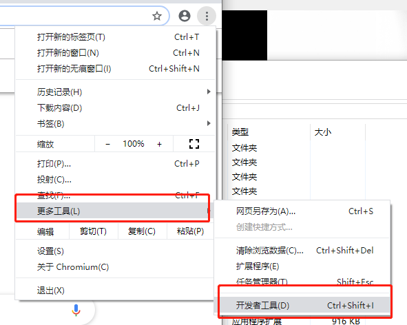
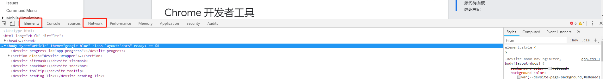
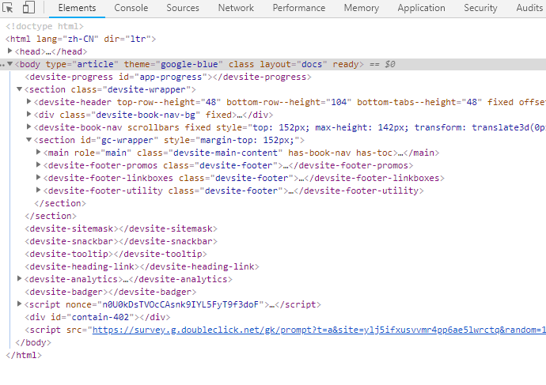

# 使用Chrome开发者工具抓包

## 打开开发者工具
1、按F12或Ctrl+Shift+I  

2、菜单->更多工具->开发者工具  

## 开发者工具介绍
Chrome 开发者工具是一套内置于Google Chrome中的Web开发和调试工具，可用来对网站进行迭代、调试和分析。  
这里只介绍跟抓相关的功能，**Elements**和**Network**  

完整的开发者工具文档可以访问https://developers.google.com/web/tools/chrome-devtools/

## Elements(元素面板)
在Elements选项卡下，可以看到当前网页的DOM树  

