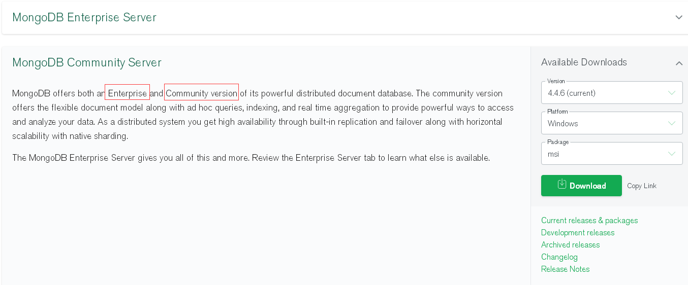
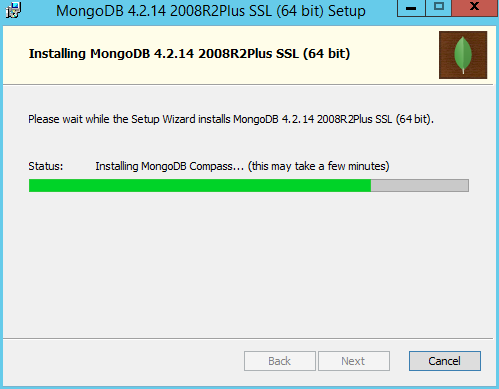
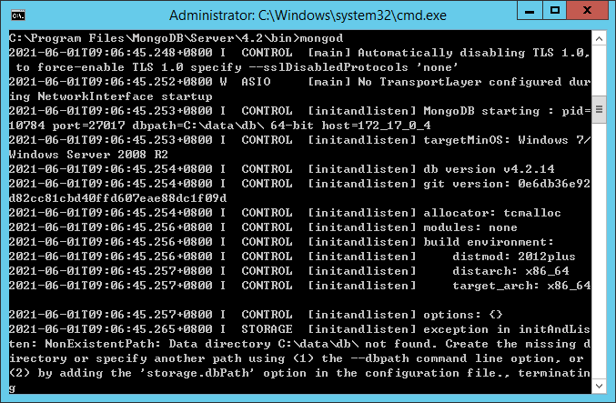
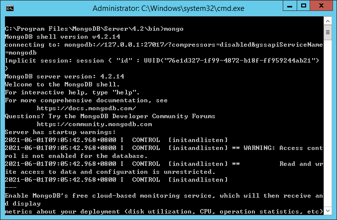
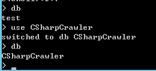

# MongoDB介绍
* MongoDB是一种key-value数据库
* MongoDB是一种非常流行的NoSQL数据库。

## NoSQL
NoSQL仅仅是一个概念，泛指非关系型的数据库，区别于关系数据库（如SQL Server,Oracle,MySQL等）。NoSQL不保证关系数据的ACID特性，数据之间无关系。  


NoSQL可以分为以下种类
* 键值(Key-Value)存储数据库(如Redis,Oracle BDB)。BDB在前面已经介绍过了
* 列存储数据库
* 文档型数据库(MongoDB)
* 图形(Graph)数据库


分类|Examples举例|典型应用场景|数据模型|优点|缺点
:--:|:--:|:--:|:--:|:--:|:--:  
键值（key-value）|Tokyo Cabinet/Tyrant， Redis， Voldemort， Oracle BDB|内容缓存，主要用于处理大量数据的高访问负载，也用于一些日志系统等等。|Key 指向 Value 的键值对，通常用hash table来实现|查找速度快|数据无结构化，通常只被当作字符串或者二进制数据
列存储数据库|Cassandra， HBase， Riak|分布式的文件系统|以列簇式存储，将同一列数据存在一起|查找速度快，可扩展性强，更容易进行分布式扩展|功能相对局限
文档型数据库|CouchDB， MongoDb|Web应用（与Key-Value类似，Value是结构化的，不同的是数据库能够了解Value的内容）|Key-Value对应的键值对，Value为结构化数据|数据结构要求不严格，表结构可变，不需要像关系型数据库一样需要预先定义表结构|查询性能不高，而且缺乏统一的查询语法。
图形(Graph)数据库|Neo4J， InfoGrid， Infinite Graph|社交网络，推荐系统等。专注于构建关系图谱|图结构|利用图结构相关算法。比如最短路径寻址，N度关系查找等|很多时候需要对整个图做计算才能得出需要的信息，而且这种结构不太好做分布式的集群方案。

## 安装MongoDB  
* MongoDB版本介绍  
MongoDB分为社区版和企业版，区别如下：  


* 下载  
打开MongoDB下载页面(https://www.mongodb.com/try/download/community)，下载MongoDB安装包  
这里下载社区版(https://fastdl.mongodb.org/windows/mongodb-windows-x86_64-4.4.6-signed.msi) [2021.06.01 v4.4.6]  
**说明：演示使用的是4.2.14.因为4.4.6需要Windows Server 2016/Windows 10，我的服务器装的是Windows Server 2012系统**

* 执行安装  
没有什么要注意的选项，直接下一步执行安装即可（默认安装路径：C:\Program Files\MongoDB\Server\4.2）  
  
安装完成后，会创建一个服务,用于监听客户连接请求（默认是127.0.0.1:27017）

## mongod.exe和mongo.exe  
mongod是服务端,当客户端连接到服务端以后，服务端的界面会显示为当前有几个用户端与服务端保持连接   


mongo是客户端(后台管理 Shell)，MongoDB Shell是MongoDB自带的交互式Javascript shell,用来对MongoDB进行操作和管理的交互式环境.  
mongo shell的功能非常强大，这里只简单介绍，如果想详细了解，可以访问https://docs.mongodb.com/manual/mongo/#the-mongo-shell  


* 切换数据库  
打开*cmd*，切换到MongoDB安装目录，输入  
```
mongo
```


输入  
```
db
```
可以查看当前的数据库  


输入  
```
use CSharpCrawler
```
可以切换到CSharpCrawler数据库。如果CSharpCrawler数据库不存在，则会自动创建  


输入
```
use CSharpCrawler
db.dropDatabase()
```
可以删除CSharpCrawler数据库  

## MongoDB中的概念
通过下表，可以有个大概的了解
SQL概念|MongoDB概念|说明
:--:|:--:|:--:
database|database|数据库
table|collection|数据库表/集合
row|document|数据记录行/文档
column|field|数据字段/域
index|index|索引
table|joins|表连接,MongoDB不支持
primary key|primary key|主键,MongoDB自动将_id字段设置为主键
union|embedded/nested documents|表联合，MongoDB中是嵌入文档
view|view|视图

*SQL*
ID|URL|Title|Tag
:--:|:--:|:--:|:--:
1|https://www.google.com|Google|Search Engine
2|https://www.baidu.com|Baidu|Search Engine

*MongoDB*
```
{
    _id:ObjectId("60b597084ebae40a50ea1a25"),
    "Url": "https://www.google.com",
    "Title": "Google",
    "Tag": "Search Engine"      
}
```

### Database(数据库)  
数据库的概念和SQL基本一致。MongoDB的单个实例可以创建多个数据库,每个数据库都有自己的集合和权限，不同的数据库也放置在不同的文件中。  
默认数据库为"db"，使用mongo shell的"show dbs"命令可以查看所有数据库  

安装完成后，系统会创建三个默认数据库：  
  * admin  
    从权限的角度来看，这是"root"数据库。要是将一个用户添加到这个数据库，这个用户自动继承所有数据库的权限。一些特定的服务器端命令也只能从这个数据库运行，比如列出所有的数据库或者关闭服务器。  
  * local  
    这个数据永远不会被复制，可以用来存储限于本地单台服务器的任意集合  
  * config  
    当Mongo用于分片设置时，config数据库在内部使用，用于保存分片的相关信息  

### Collection(集合)  
集合就是MongoDB的文档组  
集合类似于SQL中的Table  
集合存在于数据库中，没有固定的结构  

命名要求：  
   * 不能是空字符串
   * 不能包含'\0'(空字符)，这个字符表示集合名的结尾
   * 不能以'system.'开头，这是为系统集合保留的前缀
   * 不能含有保留字符，如$

### BSON
在介绍Document之前需要了解一下BSON这种数据格式
BSON:Binary JSON(二进制JSON)，能用于表示简单的数据结构、关联数组及MongoDB中的各种数据类型

*JSON和BSON*
BSON的类型名义上是JSON类型的一个超集（JSON没有date或字节数组类型），但一个例外是没有像JSON那样的通用“数字”（number）类型

*BSON的常见数据类型*
* string["CSharpCrawler"]
* integer（32或64位）[520]
* double（64位IEEE 754浮点数）[520.1314]
* date（整数，自UNIX时间的毫秒数) [new Date("01/06/2012")]
* boolean（true或false）[true]
* null [null]
* BSON对象[ObjectId(),ObjectId类似唯一主键，可以很快的去生成和排序，包含12bytes]  
**ObjectId组成规则：前4个字节表示创建的时间戳(UTC时间)，接下来3个字节是机器标识码，紧接的2个字节由进程id和pid组成，最后3个字节是随机数**
* BSON数组["abc","def","ghi"]
* JavaScript代码[function(){/Test code/}]
* 正则表达式（Perl兼容的正则表达式，即PCRE，版本8.41，含UTF-8支持；与Python不完全兼容）[/u01/i]

### Document(文档)  
文档是一组键值对(BSON)。MongoDB的文档不需要设置相同的字段，并且相同的字段不需要相同的数据类型  

如  
```
{
    Title: "Google",
    Tag: "Search Engine"      
}
```

*注意*
* 区分类型和大小写  
* 不能有重复的键  
* 键是字符串。除了少数例外情况，键可以使用任意UTF-8字符  
* 键不能含有'\0'  
* .和$只能在特定环境下才能使用  
* 避免使用'_'开头的键  

## 图形客户端

## 总结
有了以上的理论知识，就可以在C#中使用MongoDB数据库了，具体使用步骤，可以参照示例程序中的【爬虫数据存储/MongoDB】
如果觉得对理论的理解还不是很透彻的话，可以参考：  
MongoDB官方手册  
https://docs.mongodb.com/manual/
菜鸟教程  
https://www.runoob.com/mongodb/mongodb-tutorial.html